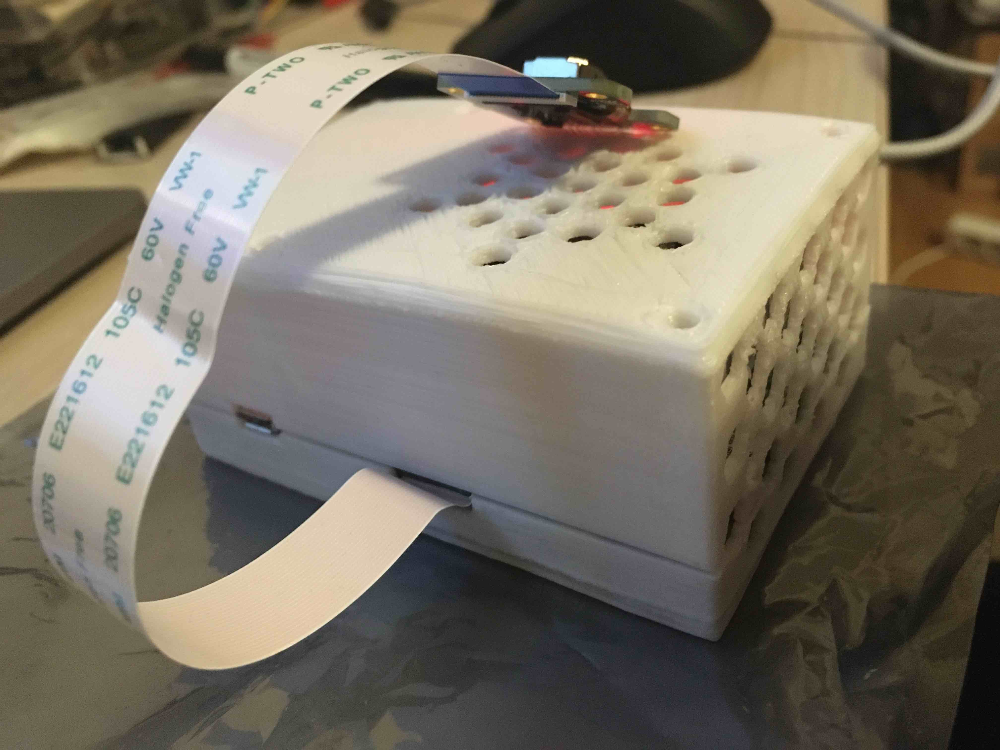
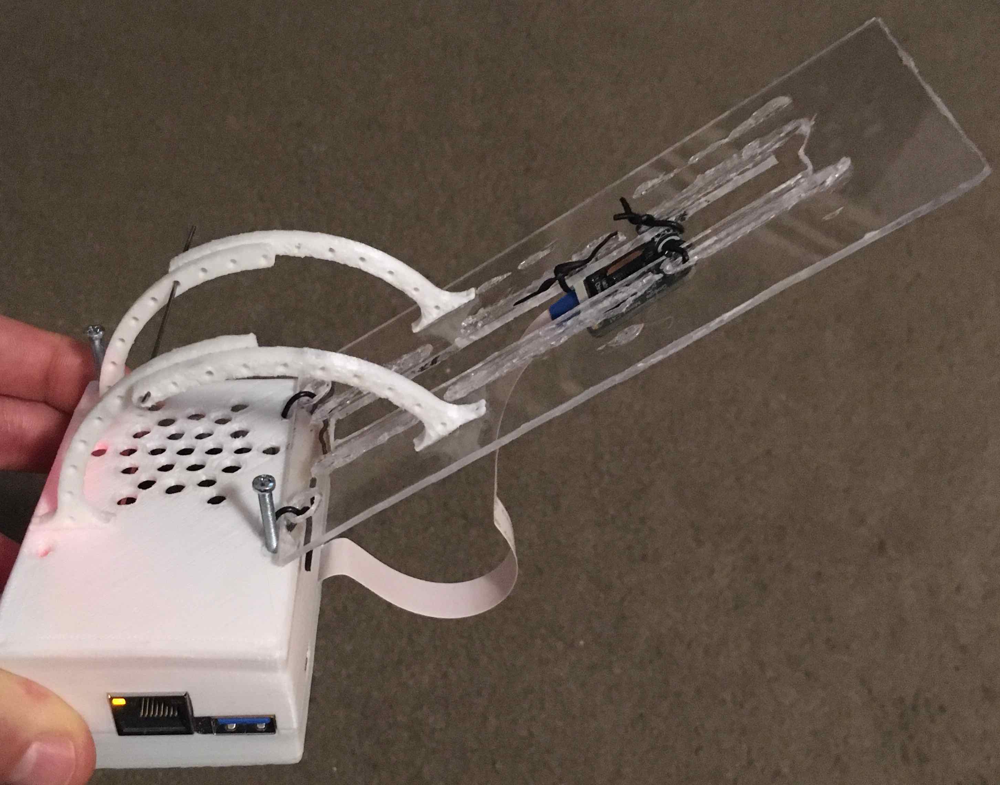

# Fork from google-coral

This repo contains a fork of Google-coral's exemple projects from which i have deviated a program which identifies faces.  
The scope of the app is to track how many pull-ups does each team member do.  
The camera will be mounted on a pull-up bar. So it will see only faces of those who did a pullup.

## Hardware - the case

I have printed [this](https://www.thingiverse.com/thing:3561461).

Made a system to be able to change the angle of the camera.
And its height.


## Internal Env

Needed to build and [install OpenCV](https://medium.com/@balaji_85683/installing-opencv-4-0-on-google-coral-dev-board-5c3a69d7f52f) in order to save to video. Also check out this guy's [comment](https://medium.com/@trentonfehl/if-youd-like-this-to-work-outside-of-the-virtual-environment-the-following-command-worked-for-me-f33bff3f2b3).

## Implementation

1. Used Gstreamer to receive images.
2. Used Face detector to identify faces on each received image.
3. If any face is found, start a video session, until X (5-for now) seconds have passed without seeing any face.
4. Count the **face is found** <-> **face is not found** transitions in order to get the count of all pullups.
5. *TO BE DONE* Use Face detector's output to crop faces and classify between team members.
6. Save the classified team memeber's name, date, number of pullups, and evidence location (the video) to a csv.

# -- Google Coral --
# Edge TPU simple camera examples

This repo contains a collection of examples that use camera streams
together with the Edge TPU Python API.

## Installation

Before you start using the examples run
the ```download_models.sh``` script in order to download a selection of models.
These canned models will be downloaded and extracted to a new folder
```all_models```.


Further requirements may be needed by the different camera libraries, check the
README file for the respective subfolder.

## Contents

  * __Gstreamer__ Python examples using gstreamer to obtain camera images. These
    examples work on Linux using a webcam, Raspberry Pi with
    the Raspicam and on the Coral DevBoard using the Coral camera. For the
    former two you will also need a Coral USB Accelerator to run the models.
  * __Raspicam__ Python example using picamera. This is only intended for
    Raspberry Pi and will require a Coral USB Accelerator.
    Use ```install_requirements.sh``` to make sure all the dependencies are
    present.
  * __PyGame__ Python example using pygame to obtain camera frames.
    Use ```install_requirements.sh``` to make sure all the dependencies are
    present.
  * __OpenCV__ Python example using OpenCV to obtain camera frames.
    Use ```install_requirements.sh``` to make sure all the dependencies are
    present.

## Canned models

For all the demos in this repository you can change the model and the labels
file by using the flags flags ```--model``` and
```--labels```. Be sure to use the models labeled _edgetpu, as those are
compiled for the accelerator -  otherwise the model will run on the CPU and
be much slower.

For classification you need to select one of the classification models
and its corresponding labels file:

```
inception_v1_224_quant_edgetpu.tflite, imagenet_labels.txt
inception_v2_224_quant_edgetpu.tflite, imagenet_labels.txt
inception_v3_299_quant_edgetpu.tflite, imagenet_labels.txt
inception_v4_299_quant_edgetpu.tflite, imagenet_labels.txt
mobilenet_v1_1.0_224_quant_edgetpu.tflite, imagenet_labels.txt
mobilenet_v2_1.0_224_quant_edgetpu.tflite, imagenet_labels.txt

mobilenet_v2_1.0_224_inat_bird_quant_edgetpu.tflite, inat_bird_labels.txt
mobilenet_v2_1.0_224_inat_insect_quant_edgetpu.tflite, inat_insect_labels.txt
mobilenet_v2_1.0_224_inat_plant_quant_edgetpu.tflite, inat_plant_labels.txt
```

For detection you need to select one of the SSD detection models
and its corresponding labels file:

```
mobilenet_ssd_v1_coco_quant_postprocess_edgetpu.tflite, coco_labels.txt
mobilenet_ssd_v2_coco_quant_postprocess_edgetpu.tflite, coco_labels.txt
mobilenet_ssd_v2_face_quant_postprocess_edgetpu.tflite, coco_labels.txt
```


